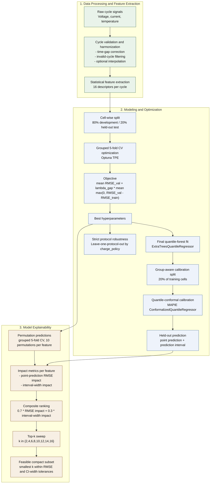

# Methodology Pipeline Overview

This Mermaid diagram mirrors the active methodology structure used in the paper:

1. Data Processing and Feature Extraction
2. Modeling and Optimization
3. Model Explainability

You can paste the block below into any Mermaid-compatible editor and export it
manually for the paper.

## Compressed Alternative

This version is more paper-friendly:

- uses a left-to-right layout to exploit horizontal space,
- merges a few tightly coupled steps into single boxes,
- keeps the same methodological content with shorter labels.

```mermaid
flowchart LR
    %% =========================
    %% Data Processing
    %% =========================
    subgraph A["1. Data Processing and Feature Extraction"]
        direction LR
        A1["Raw cycle signals<br/>V, I, T"]
        A2["Cycle validation<br/>gap correction, invalid-cycle filtering,<br/>optional interpolation"]
        A3["Statistical feature extraction<br/>16 descriptors per cycle"]
        A1 --> A2 --> A3
    end

    %% =========================
    %% Modeling
    %% =========================
    subgraph B["2. Modeling and Optimization"]
        direction LR
        B1["Cell-wise split<br/>80% development / 20% test"]
        B2["Grouped 5-fold CV optimization<br/>TPE; objective = mean RMSE_val + lambda_gap * mean gap"]
        B3["Best hyperparameters"]
        B4["Final quantile forest<br/>ExtraTreesQuantileRegressor"]
        B5["Group-aware calibration<br/>20% of training cells"]
        B6["Quantile-conformal prediction<br/>MAPIE CQR; point + interval"]
        B7["Strict protocol LOPO<br/>by exact charge_policy"]
        B1 --> B2 --> B3 --> B4 --> B5 --> B6
        B3 --> B7
    end

    %% =========================
    %% Explainability
    %% =========================
    subgraph C["3. Model Explainability"]
        direction LR
        C1["Permutation predictions<br/>5 grouped folds, 10 permutations"]
        C2["Feature impacts<br/>RMSE impact + CI-width impact"]
        C3["Composite ranking<br/>0.7 RMSE + 0.3 CI width"]
        C4["Top-k compactness sweep<br/>k in {2,4,6,8,10,12,14,16}"]
        C5["Selected compact subset<br/>smallest feasible k"]
        C1 --> C2 --> C3 --> C4 --> C5
    end

    %% =========================
    %% Cross-block flow
    %% =========================
    A3 --> B1
    B3 --> C1
    B6 --> C2

    %% =========================
    %% Styling
    %% =========================
    classDef data fill:#e9f3ea,stroke:#3e6b47,color:#111;
    classDef model fill:#eef3fb,stroke:#446a9e,color:#111;
    classDef explain fill:#f7efe4,stroke:#8a5a2b,color:#111;

    class A1,A2,A3 data;
    class B1,B2,B3,B4,B5,B6,B7 model;
    class C1,C2,C3,C4,C5 explain;
```

