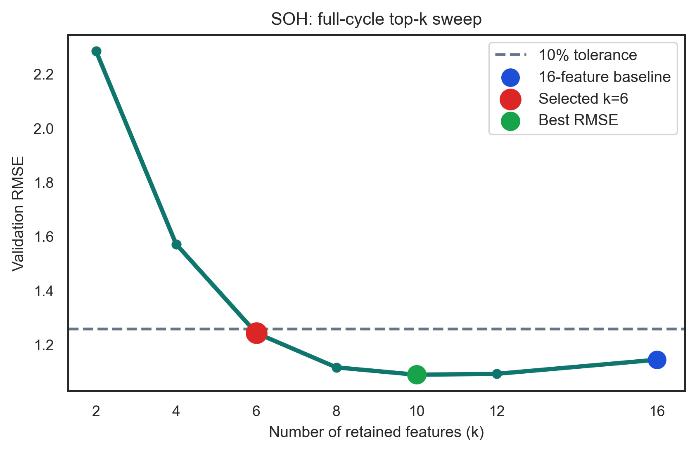
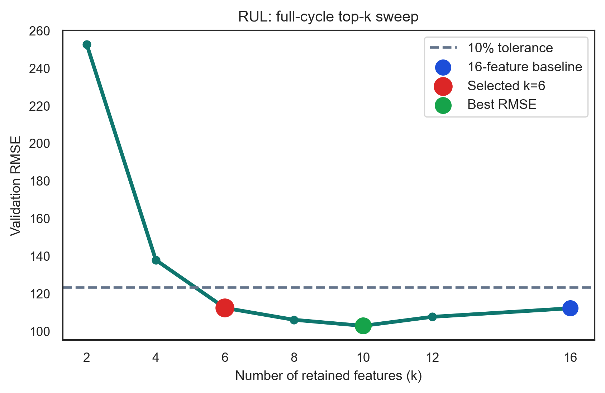
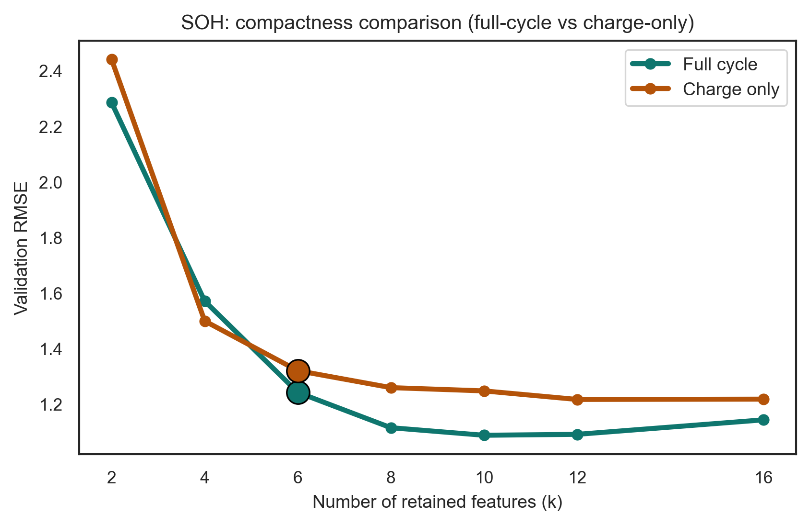
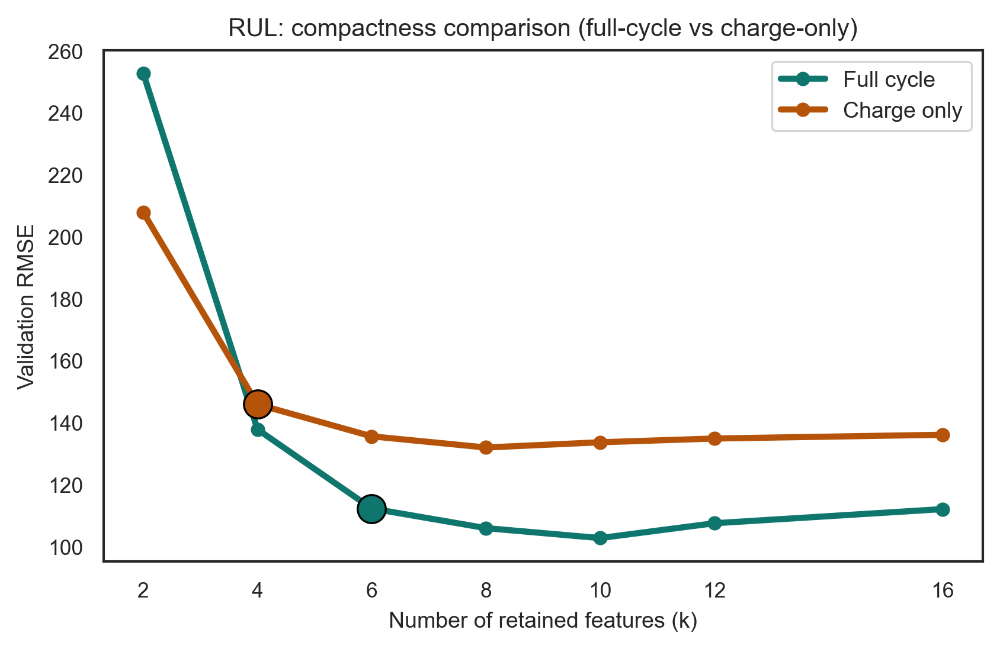
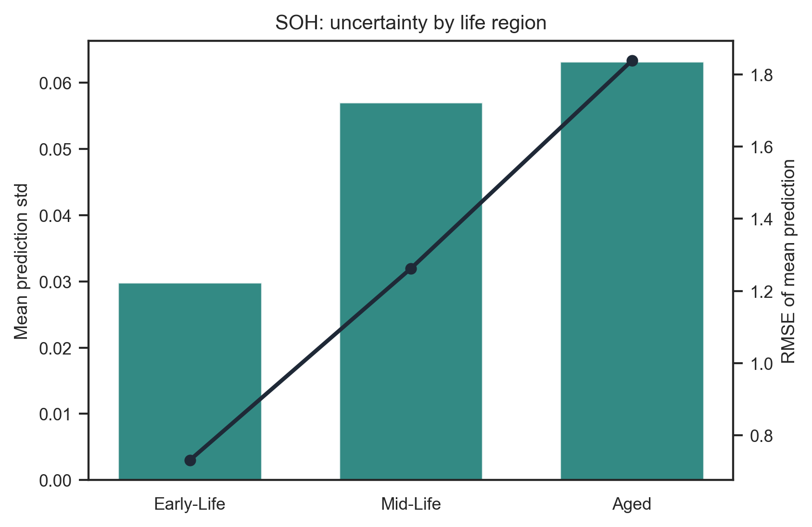
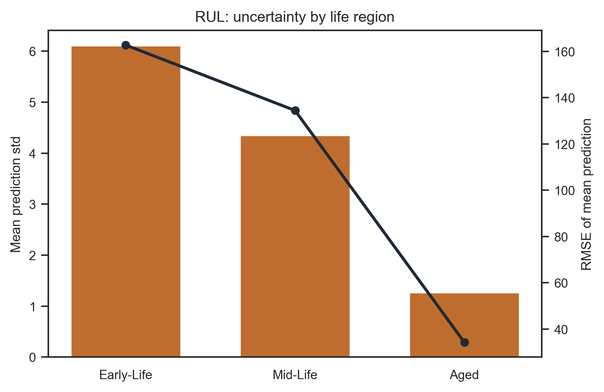
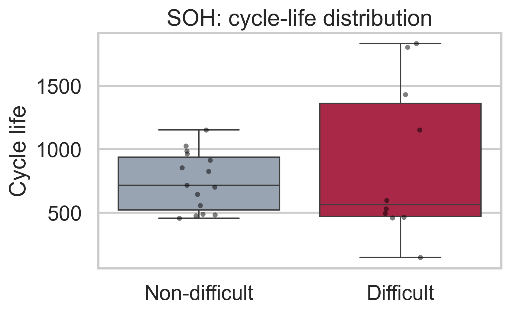
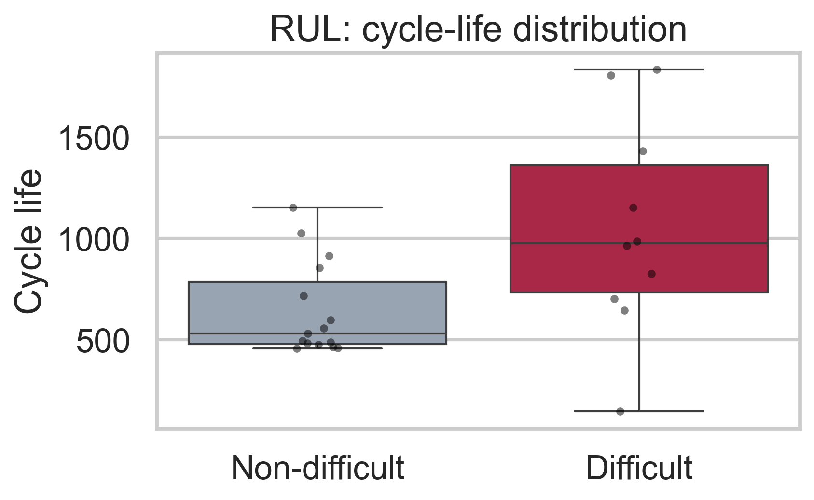

# Methodology

## Baseline Full-Cycle Modeling

Our experimental study adopts a single reference model family, Extremely Randomized Trees (`ExtraTrees`), to isolate the contribution of feature design from the confounding effects of broad model-family comparison. This choice is consistent with the central objective of the study: to determine how much prognostic information can be extracted from lightweight statistics computed on a single diagnostic cycle, and how robust those statistics remain under feature reduction, partial-cycle observation, and generalization across protocol families.

The methodology was organized into six experiment tracks, each designed to answer a distinct scientific question while preserving the same model family and, for most tracks, the same underlying cell-wise split: baseline full-cycle modeling, full-cycle feature analysis, charge-only feature analysis, repeated-seed uncertainty analysis, difficult-cell diagnostics, and protocol-family robustness. The primary targets of the study are SoH and cycle-based RUL, and a separate optimization was carried out for each target and each feature view used in the analyses. Consequently, the full-cycle SoH model, full-cycle RUL model, charge-only SoH model, and charge-only RUL model each have their own optimized hyperparameter set. The purpose of this optimization stage was not only to minimize validation error, but also to identify a stable reference configuration on which the subsequent ranking, ablation, uncertainty, and robustness analyses could be built.

All experiments were conducted on the same cycle-level feature table, but not all tracks used the same evaluation partition. The baseline, feature-analysis, charge-only, uncertainty, and difficult-cell tracks used a fixed cell-wise train-test split in which entire cells, rather than individual cycles, were assigned to the training or test partition. This design prevents leakage of cell-specific degradation trajectories across partitions and ensures that every reported test result in those tracks reflects generalization to previously unseen cells. The resulting split contains 99 training cells and 25 held-out test cells, corresponding to 79,001 training cycles and 20,184 test cycles. The protocol-family robustness track used a separate leave-one-family-out design described below because its purpose was to test transfer across protocol groups rather than performance under a single random cell holdout.

Hyperparameter optimization was performed only on the training cells through grouped 5-fold cross-validation, with folds defined by cell identity so that all cycles from a given cell remain together within each fold. The optimization objective combined predictive accuracy and overfitting control:

$$
\mathrm{Objective} = \mathrm{RMSE}_{\mathrm{val}} + \frac{\left| \mathrm{RMSE}_{\mathrm{train}} - \mathrm{RMSE}_{\mathrm{val}} \right|}{\mathrm{RMSE}_{\mathrm{val}}}.
$$

In this expression, $\mathrm{RMSE}_{\mathrm{val}}$ denotes the root mean squared error on the validation folds and therefore measures predictive accuracy on unseen cells within the training partition. The second term is the relative gap between training and validation RMSE and therefore acts as a dimensionless regularizing penalty against hyperparameter sets that over-specialize to the training folds. Because the optimization was performed independently for each target-feature-view combination, this objective should be interpreted only as a within-task model-selection rule rather than as a quantity that is numerically comparable across SoH and RUL. Its practical influence also depends on the scale of the target RMSE, so it serves as a secondary preference for stability rather than as a co-equal term with validation error in an absolute cross-target sense. This is particularly relevant for battery prognosis because cycle-level datasets contain many highly correlated samples within each cell and can otherwise reward overly specialized models.

The hyperparameter search space used in these optimizations is summarized in Table M3. The same search space was used for the full-cycle and charge-only baselines, with the optimization performed independently for each target-feature-view combination. The values in this table are taken from the saved optimization-cache metadata, which is the authoritative record of the search space actually used to generate the reported artifacts.

**Table M3. Hyperparameter search space used in the `ExtraTrees` optimization. Columns report the optimized hyperparameter, its type in the search procedure, and the candidate values or bounds explored during TPE optimization.**

| Hyperparameter | Search type | Candidate values or bounds |
| --- | --- | --- |
| `n_estimators` | Integer | 50 to 500 |
| `criterion` | Fixed | `squared_error` |
| `max_depth` | Integer | 3 to 20 |
| `min_samples_split` | Integer | 2 to 20 |
| `min_samples_leaf` | Integer | 1 to 10 |
| `max_features` | Categorical | `sqrt`, `log2`, `None` |

The baseline full-cycle configuration used the complete set of 16 statistical features extracted from voltage, current, and temperature over the full diagnostic cycle. This baseline is used only for the full-cycle analyses, namely the baseline full-cycle evaluation, the full-cycle feature ranking, the full-cycle top-k sweep, the full-cycle leave-one-feature-out analysis, and the full-cycle no-temperature ablation. The charge-only analyses do not reuse the full-cycle baseline; instead, they rely on a separate charge-only baseline built from the 16 charge-segment features and optimized independently for each target. The full-cycle and charge-only tracks should therefore be interpreted as two parallel analysis branches rather than as a single baseline reused across feature views.

Because the later sections repeatedly discuss the physical meaning of the ranked features, Table M1 summarizes the intended interpretation of each extracted statistic. The charge-only features follow the same interpretation, but restricted to the charging segment only.

**Table M1. Physical interpretation of the extracted statistical features. Columns report the feature name and the main physical or signal-shape meaning attributed to it in this work.**

| Feature | Physical interpretation |
| --- | --- |
| `V_mean` | Average voltage level over the cycle; reflects the balance between time spent in low-voltage and high-voltage regions. |
| `V_median` | Typical voltage level; sensitive to the occupancy of the voltage plateaus and the duration of constant-voltage phases. |
| `V_std` | Voltage dispersion; captures how broadly the voltage trajectory spreads over the cycle as resistance and plateau compression evolve. |
| `V_iqr` | Robust voltage spread; measures the width of the central voltage distribution and is less sensitive to outliers than the standard deviation. |
| `V_kurtosis` | Peakedness of the voltage distribution; reflects whether the signal concentrates around a few voltage levels or remains broadly distributed. |
| `V_entropy` | Diversity or irregularity of voltage values; decreases when the trajectory becomes more concentrated on extended plateau-like regions. |
| `I_mean` | Average current level over the cycle segment; influenced by the balance of high-current and low-current regimes. |
| `I_median` | Typical current level; sensitive to the time spent in lower-current constant-voltage portions. |
| `I_std` | Current dispersion; measures the diversity of current regimes experienced during the cycle. |
| `I_iqr` | Robust current spread; captures the central range of current values across constant-current and constant-voltage portions. |
| `I_kurtosis` | Peakedness of the current distribution; indicates whether the current is concentrated around a few regimes or broadly distributed. |
| `T_mean` | Average thermal load during the cycle; reflects the overall temperature level reached under the applied current profile. |
| `T_median` | Typical cycle temperature; complements `T_mean` when the temperature trajectory is skewed by brief peaks. |
| `T_std` | Temperature variability; reflects the contrast between heat-generation periods and cooling periods. |
| `T_iqr` | Robust thermal spread; quantifies the central temperature excursion during the cycle. |
| `T_kurtosis` | Peakedness of the temperature distribution; distinguishes trajectories with concentrated baseline temperatures from those dominated by brief thermal peaks. |

## Full-Cycle Feature Analysis

The full-cycle feature-analysis track was designed to answer three linked scientific questions: which single-cycle statistics are most informative for prognosis, how much redundancy exists within the 16-feature representation, and how compact a deployable feature subset can become before predictive performance deteriorates appreciably.

The first step was permutation-based feature ranking under grouped cross-validation. For each of five model seeds and each of five grouped folds, the optimized `ExtraTrees` model was trained on the training portion of the fold, evaluated on the corresponding validation portion, and then re-evaluated after shuffling one feature at a time within the validation fold. This is the same core idea used in permutation importance analyses to quantify how predictive performance changes when the information carried by one variable is destroyed while all others are preserved (Breiman, 2001; Fisher, Rudin, and Dominici, 2019). The increase in validation RMSE caused by shuffling a feature therefore provides a direct measure of that feature's contribution to predictive performance under the fitted multivariate model. Intrinsic tree-based importances were also recorded in the same runs, but only as supporting evidence. Permutation importance was treated as the primary ranking criterion because it quantifies the consequence of destroying the information carried by a feature in the actual predictive setting.

Once ranked, the features were evaluated through a top-$k$ sweep using the ordered subsets $k \in \{16, 12, 10, 8, 6, 4, 2\}$. Each subset was evaluated with grouped 5-fold cross-validation using the same optimized model hyperparameters. This design avoids confounding changes in feature subset with repeated hyperparameter re-optimization and reveals how predictive performance degrades as the feature representation becomes progressively more compact. At the same time, it should be interpreted as a controlled subset-comparison protocol rather than as a fully re-optimized estimate of the best achievable performance at each $k$, since some smaller subsets might benefit from a different hyperparameter configuration.

The final subset size was selected by a complexity-performance heuristic rather than by choosing the absolute lowest validation RMSE. Specifically, the smallest subset whose validation RMSE remained within 10% of the 16-feature baseline was selected. This criterion frames compactness as a controlled trade-off rather than an arbitrary reduction, favoring feature parsimony when the predictive penalty remains modest.

After the compact subset was selected, a leave-one-feature-out analysis was run inside that subset to determine whether all retained features contributed meaningfully or whether some remained redundant even after ranking and pruning. Finally, a no-temperature ablation was performed by removing all temperature-derived features and re-evaluating the voltage-current-only representation under the same experimental protocol. This last step was motivated by the well-known practical difficulty of obtaining stable temperature measurements in laboratory and field settings, and by the question of whether a voltage-current-only representation is already sufficient for reliable prognosis.

## Charge-Only Feature Analysis

The charge-only analysis repeated the same methodology on a feature table computed only from the charging process. The ranking, top-$k$ sweep, compact-subset heuristic, leave-one-feature-out analysis, and no-temperature ablation were all preserved unchanged. This parallel design ensures that any observed difference between full-cycle and charge-only performance can be attributed to the information content of the cycle segment itself, rather than to changes in model class, optimization strategy, or validation protocol.

The scientific motivation for this track is practical rather than purely algorithmic. Full diagnostic cycles are informative but operationally restrictive. In many real battery systems, acquiring both charge and discharge trajectories under controlled conditions is burdensome, whereas charge segments are more naturally observed. The charge-only track therefore tests whether a reduced observational window can preserve enough statistical structure for useful cross-cell prognosis.

## Uncertainty Analysis

The uncertainty track quantified the stability of the optimized `ExtraTrees` predictor with respect to repeated retraining under different random seeds. Starting from the optimized hyperparameter set, the model was retrained 20 times on the same full training partition and used to generate repeated predictions for each held-out test cycle. The resulting ensemble of predictions was summarized by its mean, standard deviation, and selected quantiles.

This procedure does not estimate all sources of predictive uncertainty, but it provides a useful measure of seed-induced model instability arising from stochastic tree construction. No extra validation split was introduced at this stage: the repeated retraining always used the original training cells, and the repeated predictions were always computed on the original held-out test cells. The analysis was further stratified by degradation stage using SoH-defined engineering regions anchored on the standard 80% SoH end-of-life convention: Early-Life (95-100%), Mid-Life (85-95%), and Aged (80-85%). This regionalization was motivated by the expectation that both signal regularity and prognostic difficulty change across the degradation trajectory. The aim was therefore not only to quantify average prediction spread under repeated retraining, but also to determine whether that spread systematically increases or decreases with aging.

## Difficult-Cell Diagnostics

Aggregate test metrics can conceal the extent to which errors are concentrated in a small subset of cells. To address this, the diagnostics track computed per-cell prediction errors on the held-out test set and ranked cells by RMSE. For each cell, the analysis recorded RMSE, MAE, signed bias, high-percentile absolute error, and the life region in which the cell's errors were most concentrated. Early-, mid-, and late-life regions were defined according to normalized cycle position within each cell, thereby distinguishing whether a cell was consistently difficult or only problematic during a specific stage of its trajectory.

The scientific motivation for this analysis is to separate diffuse model weakness from localized failure modes. If most error is concentrated in a small number of atypical cells, then the main methodological question shifts from average predictive performance to understanding heterogeneity, outliers, and the representativeness of the training data.

## Protocol-Family Robustness

The protocol-robustness track evaluated whether the learned feature-target relationships generalize across families of charging aggressiveness rather than only across randomly held-out cells. Cells were grouped into protocol families by first computing cell-level charge statistics from the charge segment, specifically the mean of `charge_I_mean` across cycles and the maximum of `charge_I_mean` across cycles after converting current to C-rate using the rated capacity. Of these statistics, only the maximum charge C-rate was used to assign the cell to a bin, while the average charge C-rate was retained only as a descriptive quantity. A second grouping flag was inferred from the charge-policy metadata by checking whether the policy text suggested an explicit rest or zero-current step. Sparse groups were merged into the nearest denser group to avoid evaluating families with too few cells. In the current dataset, the resulting evaluated families all carried the `no_rest` suffix, so the practical separation in this analysis is driven mainly by charging aggressiveness rather than by the presence or absence of explicit rest segments. A leave-one-family-out evaluation was then performed: for each family, the model was trained on all remaining families and tested only on the held-out family.

This experiment was motivated by the fact that battery prognostic signals are not only cell-dependent but also protocol-dependent. If a feature representation is truly robust, its predictive relationships should remain informative when the distribution of charging aggressiveness shifts. The family-holdout design therefore probes a stronger notion of generalization than random cell holdout alone.

**Table M2. Protocol-family labels used in the robustness analysis. Columns report the family label, the representative average and maximum charge C-rates of the cells assigned to that family, and the corresponding mean cycle life.**

| Family label | Representative average charge C-rate | Representative maximum charge C-rate | Mean cycle life |
| --- | ---: | ---: | ---: |
| `bin_0__no_rest` | 2.0696 | 2.3702 | 740.94 |
| `bin_1__no_rest` | 2.2369 | 2.5662 | 638.94 |
| `bin_2__no_rest` | 2.4077 | 2.9162 | 970.32 |
| `bin_3__no_rest` | 2.7015 | 3.2504 | 847.68 |

The values in Table M2 are not monotonic with charge C-rate: the higher-rate families do not consistently exhibit shorter mean cycle life than the lower-rate families. This indicates that, within this dataset, charge C-rate alone does not explain most of the observed lifetime variability at the family level, even though it still represents an important axis of protocol differentiation.

# Results

## Baseline Full-Cycle Performance

Table 1 summarizes the four baseline configurations used as anchors for the later analyses. All values are taken from the refactored `final_eval` campaign runs, with full-cycle and charge-only baselines treated as parallel branches under the same artifact schema. Taken together, these held-out results confirm that the feature-based `ExtraTrees` approach remains viable for cross-cell prognosis, although the two targets are not equally difficult. SoH estimation remains comparatively accurate in both settings, with test RMSE of 1.07 percentage points for the full-cycle baseline and 1.15 for the charge-only baseline, both with strong test-set $R^2$. By contrast, cycle-based RUL prediction is substantially harder, with baseline test RMSE of 145.66 cycles for the full-cycle model and 146.47 cycles for the charge-only model, together with a notably larger train-validation gap already visible in cross-validation. This asymmetry indicates that the single-cycle statistics capture present health more directly than long-horizon lifetime. For RUL, the two baseline held-out results are close enough that they should be interpreted as broadly comparable rather than as evidence of a large, stable advantage for one feature view.

**Table 1. Baseline optimization and evaluation summary. Columns report the prediction target, the baseline feature set used in that run, the number of features, the validation RMSE from grouped cross-validation, the mean train-validation relative gap, and the held-out test RMSE, MAE, and R2.**  
Source artifacts: `final_eval/*/metrics.json`, `final_eval/*/summary.json`, `final_eval/*/table.main_metrics.csv`

| Target | Baseline feature set | No. of features | CV validation RMSE | CV relative gap | Test RMSE | Test MAE | Test R2 |
| --- | --- | ---: | ---: | ---: | ---: | ---: | ---: |
| SOH | All full-cycle features | 16 | 1.1433 | 0.3333 | 1.0660 | 0.8037 | 0.9409 |
| SOH | All charge-only features | 16 | 1.2178 | 0.2459 | 1.1532 | 0.8352 | 0.9308 |
| RUL | All full-cycle features | 16 | 112.0319 | 0.7339 | 145.6603 | 89.5122 | 0.8660 |
| RUL | All charge-only features | 16 | 136.0298 | 0.7673 | 146.4735 | 95.9620 | 0.8645 |

The hyperparameter sets selected for these four baseline configurations are shown in Table 1b. The results reveal that the full-cycle RUL baseline favored deeper trees and smaller leaves than the SoH baseline, consistent with the higher structural complexity of RUL estimation. The charge-only baselines selected shallower or more regularized trees than the corresponding full-cycle baselines, which is consistent with the reduced information content of the charge-only feature view. These hyperparameter comparisons should be interpreted descriptively rather than inferentially, because no uncertainty intervals or repeated-split distributions are reported for the selected configurations.

**Table 1b. Selected hyperparameters for the four baseline models. Columns report the target, the baseline feature view, and the optimized values chosen for the `ExtraTrees` hyperparameters.**  
Source artifacts: `final_eval/*/best_params.json`

| Target | Baseline feature set | n_estimators | max_depth | min_samples_split | min_samples_leaf | max_features |
| --- | --- | ---: | ---: | ---: | ---: | --- |
| SOH | All full-cycle features | 499 | 10 | 10 | 9 | `None` |
| SOH | All charge-only features | 414 | 8 | 3 | 7 | `None` |
| RUL | All full-cycle features | 363 | 19 | 14 | 4 | `None` |
| RUL | All charge-only features | 92 | 17 | 8 | 7 | `None` |

## Full-Cycle Feature Relevance and Compactness

The full-cycle ranking results show a clear hierarchy of prognostic relevance. For SoH, the dominant features are voltage entropy, voltage standard deviation, current interquartile range, and voltage interquartile range. Interpreted through Table M1, these features emphasize how broadly the voltage trajectory is distributed and how strongly the current profile separates the dominant operating regimes within the cycle. For RUL, the ranking is led by voltage interquartile range and current standard deviation, followed by voltage entropy and voltage standard deviation, again indicating that the most useful information is carried by the dispersion and occupancy structure of the voltage curve rather than by simple mean levels alone. In both tasks, voltage-distribution descriptors dominate the upper portion of the ranking, while temperature features are absent from the most influential positions. This pattern indicates that the main single-cycle prognostic signal is encoded in the shape and dispersion of the voltage trajectory, with current statistics providing additional but secondary information.

**Table 2a. Full-cycle SoH feature ranking summary. Columns report the feature rank, the feature name, the mean validation-RMSE increase produced by permuting that feature, and the standard deviation of that increase across seeds and folds.**  
Source artifacts: `full_cycle_feature_analysis/*/ranking.permutation.csv`

| Rank | Feature | Mean RMSE increase | Stability std |
| ---: | --- | ---: | ---: |
| 1 | `V_entropy` | 1.8799 | 0.1338 |
| 2 | `V_std` | 0.7130 | 0.2623 |
| 3 | `I_iqr` | 0.4884 | 0.0473 |
| 4 | `V_iqr` | 0.4813 | 0.0941 |
| 5 | `I_kurtosis` | 0.4787 | 0.0817 |
| 6 | `V_median` | 0.4205 | 0.0594 |
| 7 | `I_median` | 0.1869 | 0.0407 |
| 8 | `I_std` | 0.1394 | 0.0318 |
| 9 | `V_kurtosis` | 0.1264 | 0.0383 |
| 10 | `I_mean` | 0.0814 | 0.0341 |
| 11 | `V_mean` | 0.0656 | 0.0255 |
| 12 | `T_kurtosis` | 0.0307 | 0.0082 |
| 13 | `T_median` | 0.0248 | 0.0117 |
| 14 | `T_mean` | 0.0149 | 0.0095 |
| 15 | `T_iqr` | 0.0006 | 0.0120 |
| 16 | `T_std` | -0.0026 | 0.0115 |

**Table 2b. Full-cycle RUL feature ranking summary. Columns report the feature rank, the feature name, the mean validation-RMSE increase produced by permuting that feature, and the standard deviation of that increase across seeds and folds.**  
Source artifacts: `full_cycle_feature_analysis/*/ranking.permutation.csv`

| Rank | Feature | Mean RMSE increase | Stability std |
| ---: | --- | ---: | ---: |
| 1 | `V_iqr` | 104.4589 | 26.7059 |
| 2 | `I_std` | 61.3457 | 45.1326 |
| 3 | `V_entropy` | 48.4977 | 10.9364 |
| 4 | `V_std` | 47.0014 | 17.9436 |
| 5 | `I_mean` | 41.4087 | 9.3307 |
| 6 | `I_median` | 38.2823 | 20.5138 |
| 7 | `V_kurtosis` | 26.0695 | 5.8031 |
| 8 | `I_kurtosis` | 13.7206 | 6.5764 |
| 9 | `V_median` | 10.0335 | 2.9792 |
| 10 | `I_iqr` | 4.1394 | 2.1203 |
| 11 | `V_mean` | 4.0592 | 1.6338 |
| 12 | `T_std` | 3.8050 | 7.2698 |
| 13 | `T_kurtosis` | 3.1329 | 1.5723 |
| 14 | `T_median` | 1.4827 | 3.1298 |
| 15 | `T_mean` | 1.4340 | 2.8267 |
| 16 | `T_iqr` | 0.2363 | 4.9880 |

The top-$k$ sweep clarifies how much redundancy exists in the 16-feature representation. For SoH, validation RMSE improves slightly when the 16-feature baseline is reduced to 10 or 12 features, indicating that the full representation contains some distracting or weakly relevant features. The compact 6-feature subset does incur a validation penalty relative to the best-performing larger subsets, but remains within the pre-defined 10% tolerance. For RUL, the pattern is similar but more pronounced: performance is best around 10 features, while the 6-feature subset remains only marginally worse than the 16-feature baseline and far better than the 4- or 2-feature variants. These results support the use of six-feature compact representations as a balanced compromise between predictive power and deployment simplicity.

The intrinsic model importances saved in the artifacts are broadly consistent with the permutation ranking and therefore support the same interpretation without changing the main conclusions. For SoH, intrinsic importance also ranks `V_entropy`, `V_median`, `V_std`, and `V_iqr` among the strongest variables. For RUL, it again elevates `V_iqr`, `V_entropy`, `V_std`, and `I_std`. Because permutation importance is more directly tied to predictive degradation when information is destroyed, it remains the main ranking criterion in the text, while intrinsic importance serves as corroborating evidence rather than as a second competing ranking.

**Table 3a. Full-cycle SoH top-k sweep. Columns report the number of retained features, the validation RMSE, the mean train-validation relative gap, the absolute RMSE change relative to the 16-feature baseline, and the corresponding percentage change.**  
Source artifacts: `full_cycle_feature_analysis/*/sweep.topk.csv`

| k | Validation RMSE | Relative gap | Absolute delta from 16-feature baseline | Percentage delta from 16-feature baseline |
| ---: | ---: | ---: | ---: | ---: |
| 16 | 1.1433 | 0.3333 | 0.0000 | 0.00% |
| 12 | 1.0912 | 0.2716 | -0.0521 | -4.56% |
| 10 | 1.0879 | 0.2612 | -0.0554 | -4.85% |
| 8 | 1.1151 | 0.2499 | -0.0282 | -2.47% |
| 6 | 1.2422 | 0.2208 | 0.0989 | 8.65% |
| 4 | 1.5707 | 0.1479 | 0.4274 | 37.38% |
| 2 | 2.2847 | 0.0988 | 1.1414 | 99.84% |

**Table 3b. Full-cycle RUL top-k sweep. Columns report the number of retained features, the validation RMSE, the mean train-validation relative gap, the absolute RMSE change relative to the 16-feature baseline, and the corresponding percentage change.**  
Source artifacts: `full_cycle_feature_analysis/*/sweep.topk.csv`

| k | Validation RMSE | Relative gap | Absolute delta from 16-feature baseline | Percentage delta from 16-feature baseline |
| ---: | ---: | ---: | ---: | ---: |
| 16 | 112.0319 | 0.7339 | 0.0000 | 0.00% |
| 12 | 107.4671 | 0.6820 | -4.5648 | -4.07% |
| 10 | 102.6867 | 0.5671 | -9.3453 | -8.34% |
| 8 | 105.8965 | 0.5281 | -6.1354 | -5.48% |
| 6 | 112.2295 | 0.5191 | 0.1976 | 0.18% |
| 4 | 137.7590 | 0.4560 | 25.7271 | 22.96% |
| 2 | 252.6106 | 0.2421 | 140.5787 | 125.48% |

The heuristic compact-subset selection chose $k=6$ for both targets, even though the absolute minimum validation RMSE appears at larger $k$. This decision is methodologically defensible because the purpose of the sweep was not to identify the single numerically best subset, but to identify the smallest subset that preserves nearly all of the predictive value of the larger representation. Under that criterion, the selected SoH subset was `V_entropy`, `V_std`, `I_iqr`, `V_iqr`, `I_kurtosis`, and `V_median`, while the selected RUL subset was `V_iqr`, `I_std`, `V_entropy`, `V_std`, `I_mean`, and `I_median`.

Later held-out follow-up runs were then used to check whether these CV-selected compact subsets remain credible on unseen cells. For SoH, the six-feature full-cycle subset remains reasonably competitive, with test RMSE 1.2474 and test $R^2 = 0.9191$, but it does not match the 16-feature baseline. For RUL, the same compactness move is more costly on the held-out cells: test RMSE rises from 145.66 to 156.63 cycles and test $R^2$ falls from 0.8660 to 0.8450. These follow-up results therefore support the compact full-cycle models primarily as deployable approximations, especially for SoH, rather than as stronger alternatives to the full 16-feature baselines.

The leave-one-feature-out results for these selected subsets are available in the saved artifacts and help quantify residual redundancy after compact-subset selection. For SoH, the largest degradation occurs when `I_kurtosis` is removed, increasing validation RMSE from 1.2422 to 1.4891, while removing `V_entropy`, `V_iqr`, or `V_std` produces smaller but still measurable losses. For RUL, removing `I_median`, `V_iqr`, or `I_mean` leads to the largest deterioration, increasing validation RMSE from 112.2295 to 128.4017, 125.1802, and 121.3636 cycles, respectively. These results indicate that the selected subsets are compact but not arbitrary: several retained variables still contribute non-negligible complementary information.

The no-temperature ablation further strengthens the conclusion that temperature contributes weakly and inconsistently in this dataset. In the cross-validation ablation artifacts, removing all temperature features improved validation RMSE for both full-cycle SoH and full-cycle RUL. This supports the view that, within the feature-analysis pipeline, temperature-derived statistics add limited marginal value. The slightly negative permutation importances observed for some temperature variables are also consistent with a noisy or redundant contribution rather than with a stable primary signal.

**Table 4. Full-cycle no-temperature ablation under grouped cross-validation. Columns compare the full 16-feature baseline and the corresponding no-temperature variant in terms of number of features, validation RMSE, mean train-validation relative gap, and optimization objective score.**  
Source artifacts: `final_eval/*/metrics.json`, `full_cycle_feature_analysis/*/ablation.no_temp.json`

| Target | Configuration | n_features | Val RMSE | Relative gap | Objective score |
| --- | --- | ---: | ---: | ---: | ---: |
| SOH | Full-cycle baseline | 16 | 1.1433 | 0.3333 | 1.4766 |
| SOH | No-temperature | 11 | 1.0869 | 0.2657 | 1.3526 |
| RUL | Full-cycle baseline | 16 | 112.0319 | 0.7339 | 112.7658 |
| RUL | No-temperature | 11 | 101.9910 | 0.5853 | 102.5763 |

Separately optimized held-out follow-up runs provide a more asymmetric picture. For SoH, the no-temperature full-cycle follow-up model is numerically better than the original 16-feature baseline, reducing test RMSE from 1.0660 to 1.0243 and increasing test $R^2$ from 0.9409 to 0.9454. For RUL, however, the held-out behavior is mixed: the no-temperature follow-up model achieves better cross-validation than the original baseline but worsens on the held-out test set, with test RMSE increasing from 145.66 to 153.31 cycles and test $R^2$ falling from 0.8660 to 0.8515. Because these comparisons are based on one fixed held-out split and are not accompanied by uncertainty intervals, they should be interpreted as directional evidence rather than as definitive proof of superiority or inferiority. The original dataset documentation reports problems with thermocouple attachment and stability, which likely contributes noise to temperature-derived statistics. Taken together, the current evidence suggests limited and unstable marginal utility for temperature rather than a uniform harmful effect.

## Charge-Only Prognostics

The charge-only results preserve the same qualitative feature hierarchy but with a more compact dominant core. Voltage median, current median, voltage entropy, and current or voltage spread statistics occupy the top of the ranking for both targets. For SoH, the six-feature charge-only subset includes `charge_V_median`, `charge_I_median`, `charge_V_entropy`, `charge_V_std`, `charge_V_iqr`, and `charge_I_std`. For RUL, the four-feature subset `charge_V_median`, `charge_I_median`, `charge_V_entropy`, and `charge_I_std` is already sufficient under the compactness heuristic. This compression relative to the full-cycle case indicates that the charging segment concentrates much of the most actionable single-cycle signal, albeit not all of it.

**Table 5a. Charge-only SoH feature ranking summary. Columns report the feature rank, the feature name, the mean validation-RMSE increase produced by permuting that feature, and the standard deviation of that increase across seeds and folds.**  
Source artifacts: `charge_only_feature_analysis/*/ranking.permutation.csv`

| Rank | Feature | Mean RMSE increase | Stability std |
| ---: | --- | ---: | ---: |
| 1 | `charge_V_median` | 1.4980 | 0.2744 |
| 2 | `charge_I_median` | 1.3504 | 0.1144 |
| 3 | `charge_V_entropy` | 0.9521 | 0.2044 |
| 4 | `charge_V_std` | 0.5725 | 0.1228 |
| 5 | `charge_V_iqr` | 0.1956 | 0.0317 |
| 6 | `charge_I_std` | 0.1494 | 0.0550 |
| 7 | `charge_I_kurtosis` | 0.1468 | 0.0265 |
| 8 | `charge_V_mean` | 0.1049 | 0.0364 |
| 9 | `charge_T_median` | 0.0865 | 0.0369 |
| 10 | `charge_I_iqr` | 0.0709 | 0.0134 |
| 11 | `charge_I_mean` | 0.0611 | 0.0153 |
| 12 | `charge_V_kurtosis` | 0.0464 | 0.0300 |
| 13 | `charge_T_kurtosis` | 0.0322 | 0.0105 |
| 14 | `charge_T_mean` | 0.0243 | 0.0072 |
| 15 | `charge_T_iqr` | 0.0144 | 0.0144 |
| 16 | `charge_T_std` | 0.0054 | 0.0058 |

**Table 5b. Charge-only RUL feature ranking summary. Columns report the feature rank, the feature name, the mean validation-RMSE increase produced by permuting that feature, and the standard deviation of that increase across seeds and folds.**  
Source artifacts: `charge_only_feature_analysis/*/ranking.permutation.csv`

| Rank | Feature | Mean RMSE increase | Stability std |
| ---: | --- | ---: | ---: |
| 1 | `charge_V_median` | 213.8374 | 32.8777 |
| 2 | `charge_I_median` | 68.0544 | 27.7644 |
| 3 | `charge_V_entropy` | 32.4691 | 14.7522 |
| 4 | `charge_I_std` | 31.4898 | 34.7147 |
| 5 | `charge_V_iqr` | 21.5297 | 6.6023 |
| 6 | `charge_I_mean` | 14.1291 | 15.9031 |
| 7 | `charge_V_mean` | 5.5687 | 6.6184 |
| 8 | `charge_I_kurtosis` | 5.3358 | 11.4103 |
| 9 | `charge_V_std` | 4.8521 | 3.0310 |
| 10 | `charge_T_median` | 2.5104 | 3.5594 |
| 11 | `charge_T_kurtosis` | 2.2075 | 2.6434 |
| 12 | `charge_T_mean` | 1.8858 | 3.4237 |
| 13 | `charge_I_iqr` | 1.7905 | 4.2008 |
| 14 | `charge_V_kurtosis` | 1.6188 | 1.6187 |
| 15 | `charge_T_iqr` | -2.1075 | 4.2539 |
| 16 | `charge_T_std` | -3.1912 | 7.7093 |

Charge-only validation performance is consistently worse than the corresponding full-cycle performance, especially for RUL. Nevertheless, the degradation is not catastrophic. For SoH, the 16-feature charge-only baseline reaches a validation RMSE of 1.2178, compared with 1.1433 for the full-cycle baseline, and a held-out test RMSE of 1.1532, compared with 1.0660 for full-cycle. For RUL, the corresponding values are 136.03 versus 112.03 cycles in validation and 146.47 versus 145.66 cycles on the held-out test set. This confirms that discharge information remains valuable in the original cross-validation analyses, but it also shows that the charging segment alone still contains substantial prognostic structure. For held-out baseline RUL, the difference between full-cycle and charge-only is small enough that it should be interpreted cautiously rather than as a decisive separation.

The charge-only top-$k$ sweep reinforces the compactness argument. For SoH, larger subsets provide slightly better validation performance, but the six-feature subset remains close enough to the baseline to justify its selection. For RUL, the compact 4-feature subset performs worse than the best 8- or 10-feature subsets, yet still retains the dominant information carriers and therefore offers a parsimonious approximation when feature count is operationally constrained. The selected compact subsets are therefore `charge_V_median`, `charge_I_median`, `charge_V_entropy`, `charge_V_std`, `charge_V_iqr`, and `charge_I_std` for SoH, and `charge_V_median`, `charge_I_median`, `charge_V_entropy`, and `charge_I_std` for RUL. As in the full-cycle case, these subset choices are determined by grouped cross-validation and the compactness heuristic, not by held-out test performance.

Later held-out follow-up runs sharpen this comparison. For charge-only SoH, the six-feature compact model does not improve over the 16-feature charge-only baseline on unseen cells: test RMSE rises from 1.1532 to 1.2999 and test $R^2$ falls from 0.9308 to 0.9121. This indicates that, in the charge-only SoH setting, the cross-validation-selected compact subset is better interpreted as a deployability trade-off than as a stronger replacement for the full 16-feature baseline. For charge-only RUL, the four-feature compact model remains workable but loses accuracy relative to the 16-feature charge-only baseline, with test RMSE increasing from 146.47 to 151.44 cycles and test $R^2$ dropping from 0.8645 to 0.8551. The held-out evidence for both targets therefore indicates that compact charge-only models should be framed as parsimonious approximations rather than as uniformly stronger alternatives.

The intrinsic-importance artifacts for the charge-only runs are also consistent with the permutation-based ranking. For SoH, intrinsic importance places `charge_V_median`, `charge_V_entropy`, and `charge_I_median` at the top, followed by `charge_V_std` and `charge_V_iqr`. For RUL, it again prioritizes `charge_V_median`, `charge_V_entropy`, `charge_I_std`, and `charge_I_median`. The ordering is not identical to the permutation ranking, but both views support the same higher-level conclusion: the dominant signal in the charge-only setting is concentrated in voltage occupancy and spread descriptors, with current statistics adding complementary information.

**Table 6a. Charge-only SoH top-k sweep. Columns report the number of retained features, the validation RMSE, the mean train-validation relative gap, the absolute RMSE change relative to the 16-feature charge-only baseline, and the corresponding percentage change.**  
Source artifacts: `charge_only_feature_analysis/*/sweep.topk.csv`

| k | Validation RMSE | Relative gap | Absolute delta from 16-feature charge-only baseline | Percentage delta from 16-feature charge-only baseline |
| ---: | ---: | ---: | ---: | ---: |
| 16 | 1.2178 | 0.2459 | 0.0000 | 0.00% |
| 12 | 1.2167 | 0.2357 | -0.0011 | -0.09% |
| 10 | 1.2475 | 0.2254 | 0.0296 | 2.43% |
| 8 | 1.2592 | 0.2053 | 0.0414 | 3.40% |
| 6 | 1.3203 | 0.1842 | 0.1024 | 8.41% |
| 4 | 1.4990 | 0.1495 | 0.2812 | 23.09% |
| 2 | 2.4398 | 0.0692 | 1.2220 | 100.34% |

**Table 6b. Charge-only RUL top-k sweep. Columns report the number of retained features, the validation RMSE, the mean train-validation relative gap, the absolute RMSE change relative to the 16-feature charge-only baseline, and the corresponding percentage change.**  
Source artifacts: `charge_only_feature_analysis/*/sweep.topk.csv`

| k | Validation RMSE | Relative gap | Absolute delta from 16-feature charge-only baseline | Percentage delta from 16-feature charge-only baseline |
| ---: | ---: | ---: | ---: | ---: |
| 16 | 136.0298 | 0.7673 | 0.0000 | 0.00% |
| 12 | 134.8096 | 0.7475 | -1.2202 | -0.90% |
| 10 | 133.6009 | 0.7248 | -2.4289 | -1.79% |
| 8 | 131.9176 | 0.6393 | -4.1123 | -3.02% |
| 6 | 135.5172 | 0.5988 | -0.5126 | -0.38% |
| 4 | 145.8439 | 0.5031 | 9.8141 | 7.21% |
| 2 | 207.7407 | 0.2436 | 71.7108 | 52.72% |

The no-temperature charge-only results again indicate that thermal features are not consistently beneficial. In the charge-only cross-validation ablations, the effect is nearly neutral for SoH and beneficial for RUL. The later held-out follow-up runs only partly reinforce that pattern. For SoH, replacing the 16-feature charge-only baseline with the 11-feature no-temperature variant slightly worsens held-out performance, with test RMSE increasing from 1.1532 to 1.1627 and test $R^2$ decreasing from 0.9308 to 0.9297. For RUL, removing charge-only temperature features reduces test RMSE from 146.47 to 128.52 cycles and improves test $R^2$ from 0.8645 to 0.8956. Because the evidence comes from one held-out split, these differences should be interpreted cautiously even when the numerical change is large. Taken together with the full-cycle ablations, this pattern again points to limited and unstable marginal utility for temperature, but not to a single uniform effect across all settings.

The leave-one-feature-out results for the selected charge-only subsets further clarify which variables remain indispensable after compactness filtering. For SoH, removing `charge_V_std`, `charge_I_median`, or `charge_V_median` increases validation RMSE from 1.3203 to 1.7332, 1.7377, and 1.4504, respectively, indicating that the compact subset is still carrying several non-redundant voltage- and current-level descriptors. For RUL, the strongest deterioration is produced by dropping `charge_I_median`, `charge_I_std`, or `charge_V_median`, which raises validation RMSE from 145.8439 to 193.0181, 186.9622, and 178.3671 cycles, respectively. As in the full-cycle case, these results show that the selected compact subsets are not merely small; they are internally structured around a few features with clearly differentiated predictive roles.

**Table 7. Charge-only no-temperature ablation under grouped cross-validation. Columns compare the full 16-feature charge-only baseline and the corresponding no-temperature variant in terms of number of features, validation RMSE, mean train-validation relative gap, and optimization objective score.**  
Source artifacts: `final_eval/*/metrics.json`, `charge_only_feature_analysis/*/ablation.no_temp.json`

| Target | Configuration | No. of features | Validation RMSE | Relative gap | Objective score |
| --- | --- | ---: | ---: | ---: | ---: |
| SOH | All charge-only features | 16 | 1.2178 | 0.2459 | 1.4638 |
| SOH | Charge-only without temperature features | 11 | 1.2277 | 0.2254 | 1.4530 |
| RUL | All charge-only features | 16 | 136.0298 | 0.7673 | 136.7971 |
| RUL | Charge-only without temperature features | 11 | 130.5267 | 0.6692 | 131.1959 |

In later held-out follow-up runs, the charge-only no-temperature models diverge by target. For SoH, test RMSE increases slightly from 1.1532 to 1.1627 and test $R^2$ decreases marginally from 0.9308 to 0.9297. For RUL, test RMSE decreases from 146.47 to 128.52 cycles and test $R^2$ rises from 0.8645 to 0.8956. These follow-up results strengthen the deployment-oriented argument that charge-only prognosis does not require temperature-derived features for RUL, while indicating a near-neutral effect for SoH.

## Uncertainty Across Life Regions

The repeated-seed uncertainty analysis shows that prediction spread is generally modest compared with absolute predictive error, but is strongly stage-dependent. For SoH, the mean prediction standard deviation increases from 0.0298 percentage points in the Early-Life region to 0.0632 in the Aged region. The corresponding predictive RMSE also worsens steadily, from 0.7308 to 1.8385. Thus, both seed-induced prediction instability and predictive inaccuracy increase as the cell approaches end-of-life. The negative $R^2$ in the Aged region indicates that this final stage remains difficult despite the relatively narrow SoH range.

For RUL, the pattern differs. The mean prediction standard deviation is largest in early life (6.11 cycles) and smallest in the aged region (1.26 cycles). Absolute predictive error follows the same trend, with RMSE falling from 162.70 cycles in early life to 34.31 cycles near end-of-life. This does not imply that late-life RUL is intrinsically easier in a relative sense; rather, the remaining lifetime itself becomes smaller, which shrinks the absolute error scale. Because the present artifact set reports only absolute errors, and because relative RUL errors become unstable near end-of-life, the important point here is that prediction spread and predictive error both vary systematically with degradation stage, but not identically across targets. A further factor that should be considered is the representativity of each SoH region in the training data: if the aged region is underrepresented, part of the observed degradation may be due to weaker statistical support rather than to an intrinsic impossibility of the task.

**Table 8. Uncertainty by life region. Columns report the target, the SoH-defined region, the RMSE and MAE of the mean repeated prediction, the corresponding R2, the mean standard deviation of the repeated predictions, and the 90th percentile of that prediction standard deviation.**  
Source artifacts: `uncertainty/*/uncertainty.by_region.csv`

| Target | Region | RMSE of mean prediction | MAE | R² | Mean prediction std | q90 prediction std |
| --- | --- | ---: | ---: | ---: | ---: | ---: |
| SOH | Early-Life | 0.7308 | 0.5911 | 0.4708 | 0.0298 | 0.0449 |
| SOH | Mid-Life | 1.2622 | 1.0044 | 0.7941 | 0.0570 | 0.0859 |
| SOH | Aged | 1.8385 | 1.3771 | -0.6453 | 0.0632 | 0.1140 |
| RUL | Early-Life | 162.7012 | 105.2180 | 0.8291 | 6.1061 | 14.0029 |
| RUL | Mid-Life | 134.4387 | 80.5313 | 0.7090 | 4.3451 | 10.2050 |
| RUL | Aged | 34.3064 | 19.4232 | -0.2420 | 1.2629 | 2.9507 |

**Table 8b. Training-sample support by SoH-defined life region. Columns report the SoH region and the number of training samples falling in that region.**

| Region | Training samples |
| --- | ---: |
| Early-Life | 43,394 |
| Mid-Life | 30,196 |
| Aged | 5,411 |

## Difficult-Cell Diagnostics

Per-cell diagnostics show that prediction error is not evenly distributed across the held-out test set. Instead, a limited subset of cells contributes disproportionately to the overall error, especially for RUL. For SoH, the ten most difficult cells have a mean RMSE of 1.3444, whereas the remaining cells average 0.7060. For RUL, the separation is much sharper: the ten most difficult cells average 144.56 cycles RMSE, compared with 42.90 cycles for the rest. This concentration of error indicates that the model is not uniformly weak; rather, it struggles with a specific subset of trajectories.

Several cells recur across both SoH and RUL diagnostics, including `b3c7`, `b1c3`, `b2c1`, `b1c0`, and `b3c39`. Their repeated appearance suggests that the most difficult cases are not target-specific accidents but persistent outliers in the held-out population. The dominant error region also differs by target. For SoH, difficult cells are frequently dominated by late-life errors, which qualitatively aligns with the worsening performance observed in the SoH-defined aged region of the repeated-seed analysis, even though the two regionalizations are not identical. For RUL, difficult cells are more often dominated by early- or mid-life errors, consistent with the larger absolute scale of remaining life in those regions. Beyond the metrics shown in Table 9, useful follow-up analyses for explaining these difficult cells include comparing their total cycle life against the training distribution, examining whether they belong to the most aggressive protocol families, inspecting whether their voltage and current feature trajectories depart from the dominant population trend, and checking whether their errors are associated with unusually large positive or negative bias.

**Table 9a. Difficult-cell diagnostics for SoH. Columns report the difficult-cell identifier, its RMSE, its MAE, and the life region in which its errors are most concentrated.**  
Source artifacts: `diagnostics/*/diagnostics.cells.csv`, `diagnostics/*/diagnostics.summary.json`

| Cell | RMSE | MAE | Dominant error region |
| --- | ---: | ---: | --- |
| `b1c20` | 1.5963 | 1.2951 | late_life |
| `b1c0` | 1.5944 | 1.2275 | late_life |
| `b2c1` | 1.5439 | 1.3335 | late_life |
| `b3c7` | 1.4120 | 1.2658 | mid_life |
| `b2c42` | 1.4018 | 1.1319 | late_life |
| `b1c3` | 1.2853 | 0.8706 | late_life |
| `b3c39` | 1.2494 | 1.1687 | late_life |
| `b1c45` | 1.1830 | 1.0070 | late_life |
| `b2c24` | 1.1171 | 0.8746 | mid_life |
| `b2c43` | 1.0605 | 0.8556 | early_life |

**Table 9b. Difficult-cell diagnostics for RUL. Columns report the difficult-cell identifier, its RMSE, its MAE, and the life region in which its errors are most concentrated.**  
Source artifacts: `diagnostics/*/diagnostics.cells.csv`, `diagnostics/*/diagnostics.summary.json`

| Cell | RMSE | MAE | Dominant error region |
| --- | ---: | ---: | --- |
| `b3c7` | 368.4326 | 317.8861 | early_life |
| `b1c3` | 210.1822 | 173.6432 | mid_life |
| `b2c1` | 163.1153 | 145.1395 | early_life |
| `b1c0` | 155.9591 | 123.3410 | mid_life |
| `b3c25` | 110.8863 | 83.6649 | early_life |
| `b3c39` | 101.6881 | 87.1706 | mid_life |
| `b1c36` | 98.2172 | 81.3563 | mid_life |
| `b3c8` | 83.5518 | 70.8162 | early_life |
| `b1c37` | 78.2553 | 61.7117 | early_life |
| `b1c40` | 75.2902 | 56.7190 | early_life |

## Protocol-Family Robustness

The family-holdout evaluation shows that the learned feature-target relationships do generalize beyond a random cell split, but not uniformly across charging aggressiveness families. The meaning of each protocol-family label is summarized in Table M2. For SoH, mean family-holdout performance remains reasonably stable, with an average RMSE of 1.4847 and family-level $R^2$ values between 0.8470 and 0.9219. This indicates that the feature representation captures degradation signatures that are at least partly portable across families of charging conditions.

RUL is more sensitive to protocol shift. Family-holdout RMSE ranges from 66.08 cycles for `bin_1__no_rest` to 196.95 cycles for `bin_2__no_rest`, with lower $R^2$ in the more difficult families. The strongest deterioration appears in the higher-rate families that also differ in mean cycle life from the lower-rate groups, although Table M2 does not by itself establish a monotonic or uniquely causal relation between aggressiveness and difficulty. These results imply that the model's cross-cell generalization is meaningful but incomplete: robustness degrades when the held-out family differs more strongly in charging regime and lifetime profile from the training families.

**Table 10a. Protocol-family robustness for SoH. Columns report the held-out protocol-family label, the RMSE, the MAE, and the R2 obtained when that family is excluded from training and used only for testing. Family characteristics are given in Table M2.**  
Source artifacts: `protocol_robustness/*/robustness.by_family.csv`, `protocol_robustness/*/robustness.summary.json`

| Held-out family | RMSE | MAE | R2 |
| --- | ---: | ---: | ---: |
| `bin_0__no_rest` | 1.2578 | 0.8944 | 0.9219 |
| `bin_1__no_rest` | 1.8110 | 0.9972 | 0.8470 |
| `bin_2__no_rest` | 1.4331 | 1.0989 | 0.8813 |
| `bin_3__no_rest` | 1.4367 | 0.8843 | 0.8840 |

**Table 10b. Protocol-family robustness for RUL. Columns report the held-out protocol-family label, the RMSE, the MAE, and the R2 obtained when that family is excluded from training and used only for testing. Family characteristics are given in Table M2.**  
Source artifacts: `protocol_robustness/*/robustness.by_family.csv`, `protocol_robustness/*/robustness.summary.json`

| Held-out family | RMSE | MAE | R2 |
| --- | ---: | ---: | ---: |
| `bin_0__no_rest` | 116.0194 | 76.4622 | 0.9272 |
| `bin_1__no_rest` | 66.0759 | 47.3833 | 0.9158 |
| `bin_2__no_rest` | 196.9549 | 113.4280 | 0.7976 |
| `bin_3__no_rest` | 175.2911 | 103.8071 | 0.7571 |

# Discussion

Our experiments indicate that single-cycle, statistics-based prognosis remains scientifically meaningful, but the evidence is more nuanced than a purely performance-centered reading would suggest. The baseline full-cycle results show that present health can be estimated more reliably than long-horizon remaining life. This asymmetry is expected: SoH is more directly tied to the immediate shape of the observed diagnostic signals, whereas RUL compresses the entire future degradation path into one target and is therefore more sensitive to heterogeneity across cells and protocols.

The feature-analysis results provide the clearest substantive conclusion of the study. Across both full-cycle and charge-only settings, the most informative variables are primarily voltage-distribution features, especially entropy, spread, and median-related descriptors. Current-distribution features contribute additional signal, particularly for RUL, but they rarely displace the leading voltage features. Temperature features, by contrast, are weak and inconsistent. Their absence from the leading ranks, the near-zero or negative permutation importance of some temperature variables, the full-cycle SoH no-temperature improvement, and the strong charge-only RUL no-temperature improvement all indicate that the present prognostic representation can often remain effective without relying on temperature-derived statistics as a core requirement. At the same time, the full-cycle RUL held-out follow-up does not improve after temperature removal and the charge-only SoH no-temperature follow-up is nearly neutral to slightly worse, so the evidence is better interpreted as limited and unstable marginal utility than as evidence that temperature is uniformly harmful. Because these model comparisons are based on one fixed held-out split without formal interval estimates, the strongest statements should remain directional rather than definitive. This finding is especially important because it shifts the interpretation of the method away from a fully tri-modal voltage-current-temperature representation and toward a more robust voltage-current core.

The compactness analysis also clarifies the methodological emphasis of the work. The best-performing subsets are not necessarily the smallest ones, and the strongest validation RMSE often occurs at 8 to 12 features rather than at the selected compact subset. However, choosing the compact subset through a 10% performance tolerance is still scientifically justified. The aim of this criterion is not to claim that six features are universally optimal, but to demonstrate that most of the predictive value can be retained with a much smaller representation. In this sense, the selected compact subsets are evidence of redundancy in the larger feature space and of a realistic complexity-performance trade-off for deployable diagnostics. This interpretation should be paired with the methodological caveat that the top-$k$ sweep did not re-optimize hyperparameters at each subset size, so the curves quantify controlled subset sensitivity rather than the absolute optimum achievable at every $k$.

The charge-only results further support this interpretation. Restricting the analysis to charging segments degrades predictive accuracy in the original cross-validation analyses, especially for RUL, but does not destroy the prognostic signal. The held-out follow-up runs are particularly informative here: charge-only SoH remains close to the full-cycle baseline, but neither the compact six-feature nor the no-temperature eleven-feature charge-only SoH variant improves over the 16-feature charge-only baseline on unseen cells. For RUL, however, the held-out evidence is mixed rather than uniformly unfavorable to charge-only. The baseline held-out results are nearly tied, the compact charge-only follow-up is only slightly better than the corresponding compact full-cycle follow-up, and the charge-only no-temperature follow-up is numerically better than the full-cycle no-temperature follow-up. These numerical differences are suggestive but should not be over-interpreted in the absence of repeated-split uncertainty estimates. The main supported conclusion is therefore that partial-cycle prognosis is feasible when operational constraints make discharge data unavailable, and that the present RUL comparison between full-cycle and charge-only views is sensitive to evaluation setting.

The uncertainty and diagnostics tracks reveal that predictive reliability is strongly stage- and cell-dependent. For SoH, both prediction spread and prediction error worsen as cells approach the aged region, indicating that late-stage degradation is not fully captured by the present single-cycle statistics. For RUL, the largest absolute errors occur early in life, when small differences in degradation trajectory correspond to large differences in remaining cycles. This difference between targets emphasizes that prediction spread under repeated retraining and predictive accuracy should not be conflated: a model may be stable across seeds and still be systematically inaccurate in a region where the target itself is difficult to infer from present-state information. A further limitation is that the present manuscript does not report region-wise sample counts in the main tables, so part of the observed deterioration may also reflect uneven statistical support across life regions.

The difficult-cell analysis shows that most of the predictive weakness is concentrated in a limited set of cells rather than distributed uniformly throughout the test population. This concentration is informative. It suggests that the dominant limitation of the current methodology is not the absence of signal in the majority of cells, but rather the inability to accommodate specific atypical trajectories. Some held-out cells appear consistently difficult across both SoH and RUL, implying that these cells are structurally unusual relative to the training population. Such behavior is compatible with variation in protocol response, hidden experimental irregularities, or degradation pathways that are underrepresented in the training data.

The protocol-family robustness results reinforce this interpretation. Generalization across charging families is meaningful but not uniform, and the RUL deterioration in some higher-rate families shows that cross-cell generalization alone is an incomplete measure of robustness. A feature representation that performs well under random cell holdout may still lose fidelity when the operational family changes. This matters for any practical deployment setting in which batteries are exposed to differing charge-rate regimes, because it indicates that feature relevance is partly conditioned by the policy family under which degradation unfolds. At the same time, the family-level results should be interpreted cautiously because the manuscript currently reports mean family characteristics but not the corresponding family sample sizes or lifetime dispersion in the main text.

These findings define a more constrained but more defensible scope for the method. The present approach supports the idea of lightweight prognosis from a single diagnostic cycle, especially for SoH and for approximate RUL stratification, but it should not be interpreted as a complete solution for real-world battery management. The study remains limited to a single chemistry, laboratory-controlled cycling, and diagnostic cycles that may not be naturally available in continuous operation. The results therefore support periodic diagnostic assessment under controlled conditions more strongly than they support direct online deployment in electric vehicles or other irregular duty-cycle systems.

From an industry perspective, the observed SoH performance is the more immediately actionable result. An error near one percentage point can be useful for diagnostic screening, warranty triage, or maintenance prioritization when SoH is estimated during scheduled service events rather than continuously. The RUL results are better interpreted as coarse risk indicators than as cycle-accurate forecasts: an error on the order of 100 to 150 cycles is too large for precise replacement scheduling, but it can still separate clearly healthy assets from assets that are approaching accelerated degradation. In that sense, the present methodology is more naturally aligned with periodic decision support and fleet-level stratification than with fine-grained operational forecasting.

Within that scope, however, the main contribution is still significant. The experiments show that a carefully ranked and pruned set of simple cycle statistics can retain substantial prognostic value, that the dominant information is largely carried by voltage-current structure rather than temperature, and that useful charge-only variants are possible even though their advantage relative to full-cycle depends on the target and on the evaluation setting. These conclusions are more valuable than a simple leaderboard result because they clarify what aspects of the signal matter, which parts of the cycle are most informative, and where the present methodology fails.
